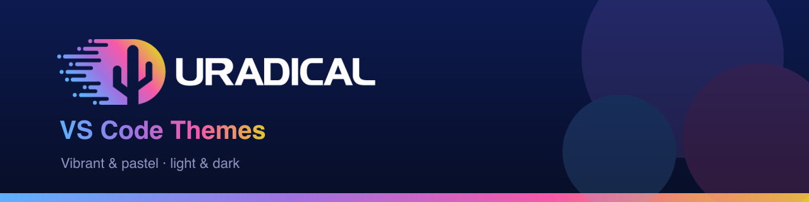
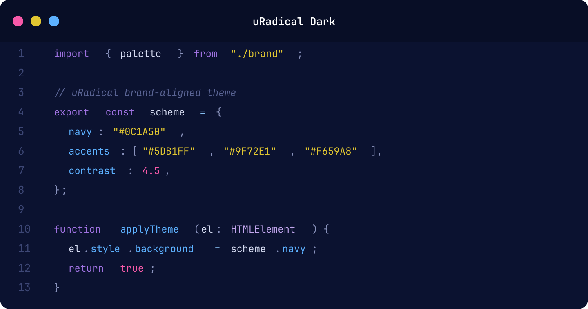
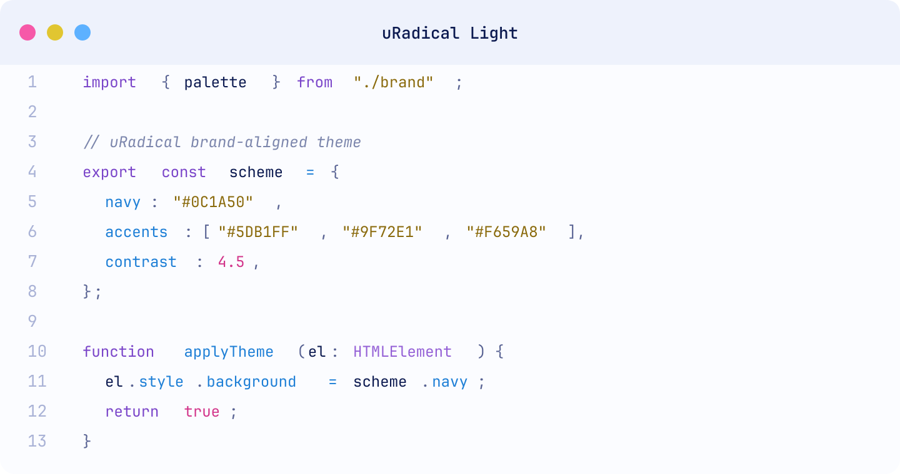
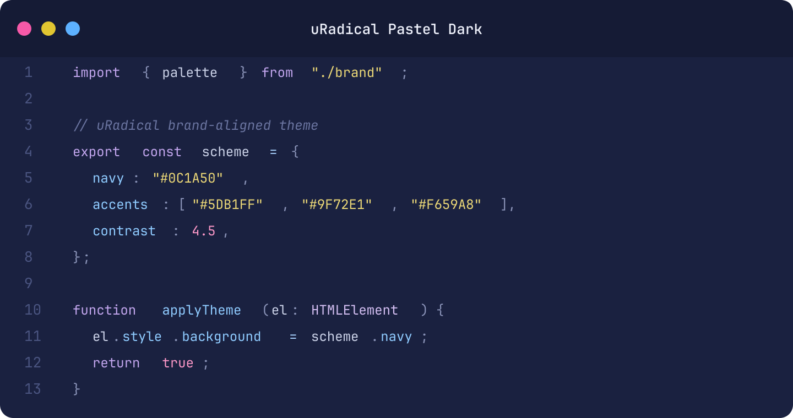
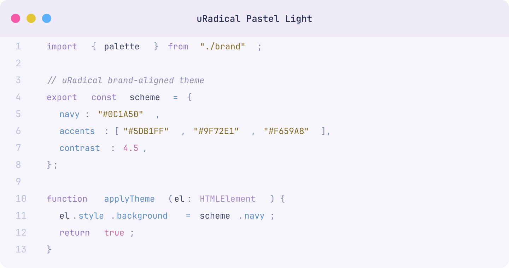

<p align="center">
  
</p>

# &nbsp; uRadical Themes

Made by [uRadical](https://uradical.io) · [Report an issue](https://github.com/uradical/vscode-uradical-themes/issues)

A set of VS Code color themes built from the [uRadical brand palette](https://uradical.io/brand) — vibrant and pastel variants, in both light and dark. Every theme draws from the same five brand colors so switching between them feels like one identity at different brightness, not four unrelated themes.

## Brand palette

| Role      | Color     | Hex       |
|-----------|-----------|-----------|
| Primary   | Navy Blue | `#0C1A50` |
| Secondary | Sky Blue  | `#5DB1FF` |
| Accent    | Purple    | `#9F72E1` |
| Accent    | Pink      | `#F659A8` |
| Accent    | Gold      | `#E1C631` |

> The brand uses a vibrant gradient flowing **blue → purple → pink → gold**. That gradient is the source for every accent in these themes.

## The four themes

### uRadical Dark
Deep navy canvas with the full vibrant gradient for syntax.



### uRadical Light
Crisp near-white canvas; accents are darkened so text stays readable on white.



### uRadical Pastel Dark
A softer, lifted navy with desaturated pastel accents — low contrast, comfortable for long sessions.



### uRadical Pastel Light
Warm lavender-tinted off-white with muted, gentle tints of the brand colors.



## Syntax mapping

The role → color mapping is identical across all four themes; only the exact shade shifts to suit each background.

| Token role                     | Brand color | Dark     | Light    | Pastel Dark | Pastel Light |
|--------------------------------|-------------|----------|----------|-------------|--------------|
| Functions, properties, links   | Sky Blue    | `#5DB1FF`| `#1E7FD6`| `#8FCBFF`   | `#5B8FCF`    |
| Keywords, storage              | Purple      | `#9F72E1`| `#7A45C9`| `#C2A6EE`   | `#9277C4`    |
| Types, classes                 | Purple (lt) | `#C2A6EE`| `#9460D6`| `#D4BFF3`   | `#A78DD2`    |
| Constants, numbers, tags, this | Pink        | `#F659A8`| `#D2348A`| `#FB97C7`   | `#C76B9E`    |
| Strings, attributes, code spans| Gold        | `#E1C631`| `#8A6A0C`| `#ECD877`   | `#7E6A1E`    |
| Plain identifiers              | Navy / fg   | `#D6DCF2`| `#0C1A50`| `#CBD2E8`   | `#3D4468`    |

> **On gold:** the literal brand gold (`#E1C631`) is essentially illegible as text on white, so the light themes use a darker gold-derived shade for strings. The true gold still appears on the light themes in find-match highlights and gutter markers, where it sits on tinted backgrounds.

Each theme also styles the full workbench — editor, sidebar, tabs, status bar, terminal ANSI palette, git decorations, and bracket-pair colorization.

## Try it without installing

1. Open this folder in VS Code: `code vscode-uradical-themes`
2. Press `F5` to launch an Extension Development Host.
3. In the new window: `Cmd/Ctrl+K Cmd/Ctrl+T` and pick a **uRadical** theme.

## Install locally

Copy the folder into your VS Code extensions directory, then reload the window:

```sh
cp -r uradical-themes ~/.vscode/extensions/uradical-themes-1.0.0
```

## Package as a .vsix

```sh
npm install -g @vscode/vsce
cd vscode-uradical-themes
vsce package
```

This produces `uradical-themes-1.0.0.vsix`, installable via **Extensions → ⋯ → Install from VSIX…** or:

```sh
code --install-extension uradical-themes-1.0.0.vsix
```

## Project layout

```
vscode-uradical-themes/
├── package.json                 # extension manifest (registers the 4 themes)
├── README.md
├── assets/
│   ├── icon.svg / icon.png      # marketplace icon (brand gradient "u")
│   ├── banner.svg / banner.png  # gallery banner
│   └── preview-*.svg / .png     # per-theme code previews (generated)
├── scripts/
│   └── generate-previews.mjs    # regenerates previews from the theme files
└── themes/
    ├── uradical-dark-color-theme.json
    ├── uradical-light-color-theme.json
    ├── uradical-pastel-dark-color-theme.json
    └── uradical-pastel-light-color-theme.json
```

The previews are generated directly from the theme JSON, so they can never drift from the actual colors. To regenerate after editing a theme:

```sh
node scripts/generate-previews.mjs
# then convert to PNG, e.g.
cd assets && for p in preview-*.svg; do rsvg-convert -z 2 "$p" -o "${p%.svg}.png"; done
```
